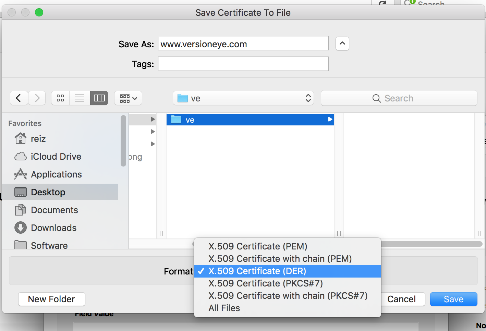

## Importing site certificate into Java Runtime

The crawlj container(s) are running on Java. When the Java process attempts to connect to a server that has an invalid or self signed certificate, such as an Maven repository server (Artifactory or Sonatype) in a development environment, there might be the following exception:

```
javax.net.ssl.SSLHandshakeException: 
sun.security.validator.ValidatorException: PKIX path building failed:
sun.security.provider.certpath.SunCertPathBuilderException: 
unable to find valid certification path to requested target
```

To make the Java runtime trust the certificate, it needs to be imported into the JRE certificate store.

### Step 1 - Get the certificate into your browser store

Browse to your application server using SSL. In pretty much all Browsers it is possible to export the site certificate. Here is described how it works in Firefox. 


Click on the domain. 


In the Security tab click on "View Certificate". 


Select the domain and click Export. 



In the download dialog select the `DER` binary format and save the file to localhost.


### Step 2 - Import the certificate into the Java Store

In general the certificate can be imported to the Java Runtime with this command:

```
keytool -import -alias alias -keystore path-to-jre/lib/security/cacerts -file path-to-certificate-file
```

In the crawlj container we are using Ubuntu and OpenJDK. The JRE is here:

```
/usr/lib/jvm/java-8-openjdk-amd64/jre
```
And the default keychain is here:

```
/etc/ssl/certs/java/cacerts
```

The full import command would look like this: 

```
keytool -import -alias alias -keystore /usr/lib/jvm/java-8-openjdk-amd64/jre/lib/security/cacerts -file /certs/www.versioneye.com
```


